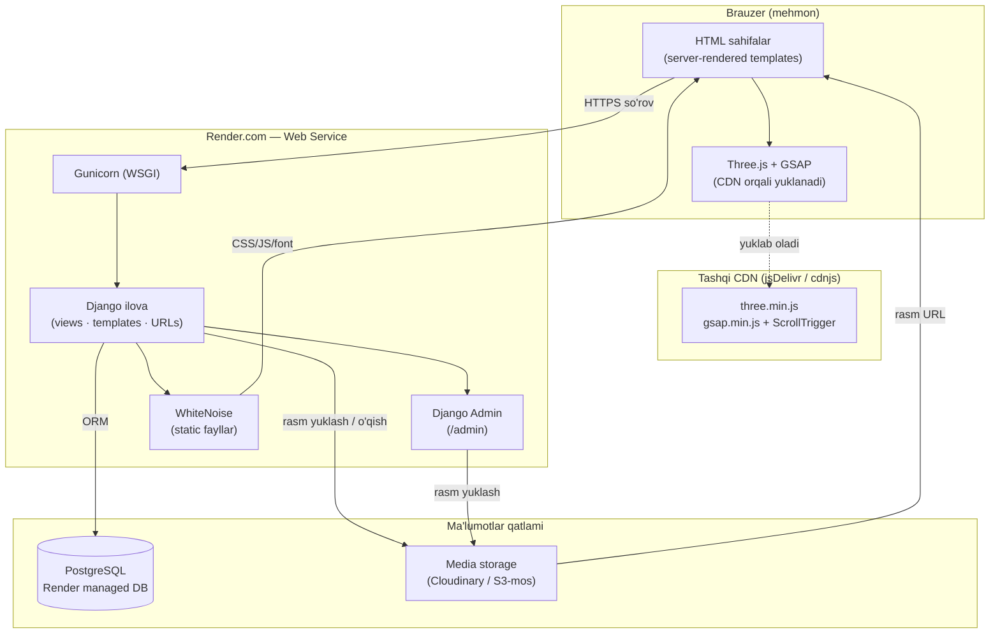
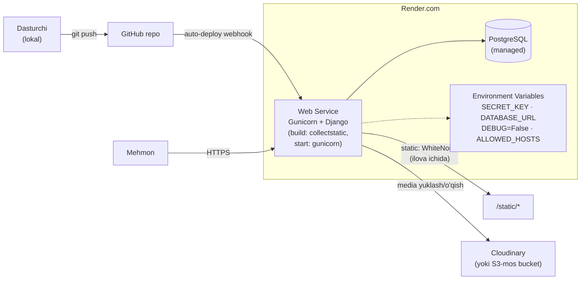

# 01 — Tizim Arxitekturasi

> Shaxsiy portfolio sayt · Django monolith · Render.com
> Rol: Senior Software Architect · Maqsad: yuqori darajadagi (high-level) arxitektura

---

## 0. Qisqacha xulosa

Bu **bitta dasturchi boshqaradigan, kichik trafikli shaxsiy sayt**. Shuning uchun
asosiy tamoyil — **soddalik**: yagona Django monolith, minimal tashqi servis,
hech qanday mikroservis / message queue / alohida kelishuv serveri yo'q.
Murakkablik faqat real ehtiyoj paydo bo'lganda qo'shiladi.

Asosiy qaror: **bitta Django ilovasi** ikkita vazifani bajaradi — (1) public
portfolio frontend, (2) Django admin orqali kontent boshqaruvi. 3D va motion
(Three.js + GSAP) **faqat CDN orqali**, build jarayonisiz, frontend qatlamida.

---

## 1. Yuqori darajadagi komponent diagrammasi

**O'qish izohi:** mehmon brauzeri server tomonda render qilingan HTML oladi
(SEO va tezlik uchun yaxshi). Motion kutubxonalari CDN'dan keladi — repozitoriyni
shishirmaydi, build kerak emas. Django ham public sahifalarni, ham `/admin`
panelini bitta jarayonda boshqaradi. Statik fayllar WhiteNoise orqali, foydalanuvchi
yuklagan media (loyiha/blog rasmlari) esa alohida tashqi storage'da.

---

## 2. Deploy / infratuzilma diagrammasi (Render.com)

### Nega media tashqi storage'da?
Render.com'da web service **ephemeral disk** ishlatadi — har deploy yoki restartda
lokal disk **tozalanadi**. Agar foydalanuvchi yuklagan rasmlarni lokal `media/`
papkaga saqlasak, keyingi deploydan keyin ular **yo'qoladi**. Shuning uchun media
albatta **persistent tashqi storage**da bo'lishi shart:

| Variant | Qachon tanlanadi | Izoh |
|---|---|---|
| **Cloudinary** | ✅ Tavsiya — shaxsiy sayt | Bepul tier kifoya, avtomatik rasm optimallashtirish/resize, `django-cloudinary-storage` orqali oson ulanadi |
| **Render Persistent Disk** | Agar Cloudinary'ga bog'lanmaslik istalsa | Qo'shimcha to'lov, lekin oddiy `MEDIA_ROOT` ishlaydi; CDN yo'q |
| **AWS S3 / Backblaze B2** | Trafik o'ssa, to'liq nazorat kerak bo'lsa | `django-storages` orqali; ko'proq sozlash |

### Nega SQLite emas, Postgres?
| | SQLite | PostgreSQL |
|---|---|---|
| Lokal dev | ✅ Ideal — fayl, sozlashsiz | Ortiqcha |
| Render production | ❌ Ephemeral diskda **ma'lumot yo'qoladi** | ✅ Managed, persistent, bepul tier bor |

**Qaror:** lokal development'da **SQLite**, production'da **PostgreSQL**.
`DATABASE_URL` environment variable'i orqali avtomatik almashtiriladi
(`dj-database-url` paketi). Bitta kod, ikki muhit.

---

## 3. Texnologiya tanlovlari jadvali

| Komponent | Tanlov | Nega aynan shu | Nega boshqasi emas |
|---|---|---|---|
| Backend framework | **Django** | Built-in admin panel = kontent boshqaruvi bepul keladi; ORM, auth, security defaultlari kuchli | FastAPI/Flask — admin panelni qo'lda qurish kerak bo'ladi |
| Web server | **Gunicorn** | Render'da standart, sodda WSGI | uWSGI — ko'proq konfiguratsiya |
| DB (prod) | **PostgreSQL (Render managed)** | Persistent, bepul tier, Django bilan birinchi-darajali qo'llab-quvvatlanadi | SQLite — ephemeral diskda yo'qoladi |
| DB (dev) | **SQLite** | Nol konfiguratsiya | — |
| Static fayllar | **WhiteNoise** | Alohida CDN/servis kerak emas, Django jarayonidan beradi, gzip/cache built-in | Nginx — qo'shimcha servis; Render'da ortiqcha |
| Media (yuklangan rasmlar) | **Cloudinary** | Persistent, avtomatik optimallashtirish + resize, bepul tier | Lokal disk — ephemeral; S3 — ko'proq sozlash |
| Motion / 3D | **Three.js + GSAP (CDN)** | Build jarayonisiz, `<script src>` bilan tugaydi | npm/webpack — bitta odamlik sayt uchun ortiqcha murakkablik |
| Email (contact form) | **SMTP (masalan Gmail App Password yoki Resend)** | Kam hajm uchun yetarli; Django `send_mail` | O'z mail serveri — ortiqcha |
| Monitoring | **Render built-in logs + UptimeRobot** | Bepul, sozlash minimal | Sentry — keyin qo'shsa bo'ladi, hozir shart emas |
| Secret boshqaruvi | **Render Environment Variables** | Kod ichida secret yo'q, repo'da `.env` yo'q | Hardcode — xavfsiz emas |

---

## 4. Xavfsizlik nuqtalari

| Soha | Chora |
|---|---|
| **Admin auth** | Kuchli parol; `/admin` yo'lini noyob path'ga o'zgartirish (masalan `/studio-panel`); ixtiyoriy `django-axes` bilan brute-force himoyasi |
| **DEBUG** | Production'da qat'iy `DEBUG=False` — stack-trace sizib chiqmaydi |
| **ALLOWED_HOSTS** | Faqat real domen(lar): `['saytim.com', 'app.onrender.com']` |
| **SECRET_KEY** | Environment variable; repozitoriyga hech qachon kommit qilinmaydi |
| **CSRF** | Django default yoqilgan; contact form'da `` majburiy; `CSRF_TRUSTED_ORIGINS` Render domeni bilan |
| **HTTPS** | `SECURE_SSL_REDIRECT=True`, `SESSION_COOKIE_SECURE=True`, `CSRF_COOKIE_SECURE=True`; Render TLS'ni avtomatik beradi |
| **Rasm yuklash xavfsizligi** | Faqat ruxsat etilgan formatlar (`jpg/png/webp`); maksimal o'lcham cheklovi (masalan 5 MB); `Pillow` orqali qayta-saqlash (EXIF/embedded payload tozalanadi); fayl nomi sanitize / UUID bilan qayta nomlash |
| **Headerlar** | `SECURE_HSTS_SECONDS`, `X_FRAME_OPTIONS='DENY'`, `SECURE_CONTENT_TYPE_NOSNIFF=True` |
| **DB** | Render managed DB faqat ichki tarmoqdan; `DATABASE_URL` sirli |

---

## 5. Kelajakda kengayish (over-engineering QILMASDAN)

| Ssenariy | Hozir arzon tayyorlash | Keyin qo'shiladigan |
|---|---|---|
| **Ko'p tillilik (UZ/RU/EN)** | Model field nomlash konvensiyasini hozirdan mos qo'yish (2-hujjatda batafsil); URL strukturani til prefiksiga moslab fikrlash | `django-modeltranslation` yoki Django i18n; `LocaleMiddleware`; til prefiksli URL'lar |
| **Trafik oshishi** | Cloudinary allaqachon CDN beradi; WhiteNoise cache headerlari yoqilgan | Render plan ko'tarish; DB connection pooling; sahifa cache (`cache_page`) |
| **Blog hajmi katta** | Pagination'ni boshidan qo'yish | To'liq matn qidiruv (Postgres `SearchVector`) |
| **Forma/analitika** | — | Plausible/Umami (cookiesiz analitika) |

**Muhim:** quyidagilar HOZIR **kerak emas** va qo'shilmasligi kerak —
mikroservis, Redis, Celery, Docker Compose stack, GraphQL, alohida frontend SPA.
Bular bu loyiha hajmi uchun ortiqcha murakkablik.

---

## 6. Asosiy risk va trade-off'lar

1. **Media persistensiyasi** — eng katta amaliy risk. Lokal `media/` ishlatib
   qo'yilsa, deploydan keyin rasmlar yo'qoladi. Trade-off: Cloudinary'ga bog'lanish
   (vendor lock-in) vs ma'lumot xavfsizligi. → Cloudinary tanlandi.
2. **Monolith = bitta nuqtali taqsimot** — admin va public bitta jarayonda. Kichik
   sayt uchun afzallik (sodda), lekin admin qulashi public'ni ham to'xtatadi.
   Risk past, chunki trafik kam.
3. **CDN bog'liqligi (Three.js/GSAP)** — CDN ishlamasa motion ishlamaydi. Yengillashtirish:
   `prefers-reduced-motion` va graceful fallback (3D yuklanmasa ham sayt o'qiladi);
   ixtiyoriy — kutubxonalarni `static/`ga ham nusxalab `<script>` fallback berish.
4. **SQLite↔Postgres farqi** — dev/prod DB har xil. Kamdan-kam, lekin DB-spetsifik
   xatti-harakat (masalan case-sensitivity) farq qilishi mumkin. → Postgres'ni
   lokalda ham ishlatish (Docker yoki Render dev DB) bu riskni yo'qotadi.
5. **Bitta dasturchi** — bus factor 1. Hujjatlashtirish (shu hujjatlar) va README
   bu riskni yumshatadi.
