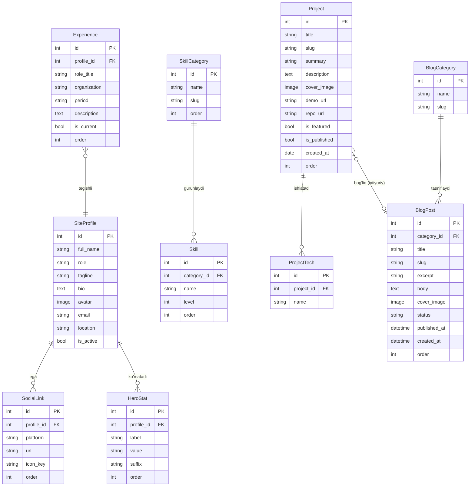

# 02 — Tizim Dizayni (System Design)

> Shaxsiy portfolio sayt · Django · Bu hujjat asosida kod to'g'ridan-to'g'ri yozilishi mumkin
> 01-Arxitektura hujjatiga mos (monolith Django · Postgres prod · Cloudinary media · Three.js/GSAP CDN)

---

## 1. ERD — Entity-Relationship Diagram



**Eslatma — ko'p tillilik tayyorgarligi:** matnli field'lar (`tagline`, `bio`,
`summary`, `description`, `excerpt`, `body`, `role_title` ...) keyinchalik
`django-modeltranslation` bilan kengaytirilganda field nomi o'zgarmaydi —
paket avtomatik `title_uz`, `title_ru`, `title_en` ustunlarini qo'shadi. Shuning
uchun **hozir field nomlarini sodda va inglizcha** qoldiramiz (`title`, `body`),
til suffiksini keyinga qoldiramiz. Bu eng arzon i18n-ready strategiya.

---

## 2. Django app bo'linishi

| App | Mas'uliyat | Modellar |
|---|---|---|
| **core** | Profil, hero, skills, tajriba, loyihalar — portfolioning "shaxs" qismi | SiteProfile, SocialLink, HeroStat, SkillCategory, Skill, Experience, Project, ProjectTech |
| **blog** | Maqolalar — alohida kontent oqimi, alohida ritmda yangilanadi | BlogCategory, BlogPost |

**Asos:** blog alohida app — chunki u **boshqa hayot tsikliga** ega (tez-tez
yangilanadi, kategoriya/status/sana mantiqi bor, kelajakda RSS/qidiruv qo'shilishi
mumkin). Loyiha/profil esa kamdan-kam o'zgaradigan "core" identifikatsiya.
Ikki app — bu **mantiqiy chegara**, ortiqcha bo'linish emas. Uchinchi app
(masalan alohida `accounts`) hozir kerak emas — Django built-in auth admin uchun yetarli.

---

## 3. URL / route xaritasi

| Path | View | Vazifasi | Template |
|---|---|---|---|
| `/` | `HomeView` | Bosh sahifa: hero + about + skills + featured loyihalar + blog preview + contact | `core/home.html` |
| `/projects/` | `ProjectListView` | Barcha published loyihalar grid | `core/project_list.html` |
| `/projects/<slug>/` | `ProjectDetailView` | Bitta loyiha to'liq sahifasi | `core/project_detail.html` |
| `/blog/` | `BlogListView` | Blog postlar ro'yxati (pagination) | `blog/post_list.html` |
| `/blog/<slug>/` | `BlogDetailView` | Bitta blog post | `blog/post_detail.html` |
| `/blog/category/<slug>/` | `BlogListView` (filtered) | Kategoriya bo'yicha filtr | `blog/post_list.html` |
| `/contact/` (POST) | `ContactView` | Contact form yuborish (email) | — (redirect + message) |
| `/admin/` → `/studio-panel/` | Django Admin | Kontent boshqaruvi | (built-in) |
| `/sitemap.xml` | `sitemap` | SEO | (Django sitemaps) |
| `/robots.txt` | static | SEO | — |

Generic class-based view'lar (`ListView`/`DetailView`) ishlatiladi — kod kam,
pagination/slug-lookup bepul keladi.

---

## 4. Admin panel tuzilishi

Har model uchun amaliy admin sozlamasi (kod emas — **qaysi field va nega**):

### `SiteProfile` (singleton — odatda 1 ta yozuv)
- `list_display`: `full_name`, `role`, `is_active`
- Maslahat: faqat bitta profil bo'lishi uchun admin'da "add" ni cheklash
  (`has_add_permission` → mavjud bo'lsa False). Inline orqali `SocialLink` va
  `HeroStat` shu sahifada tahrirlanadi (`TabularInline`).

### `Skill` + `SkillCategory`
- `Skill.list_display`: `name`, `category`, `level`, `order`
- `list_editable`: `level`, `order` — ro'yxatdan turib tez sozlash
- `list_filter`: `category`
- `SkillCategory.prepopulated_fields`: `{'slug': ('name',)}`

### `Experience`
- `list_display`: `role_title`, `organization`, `period`, `is_current`, `order`
- `list_editable`: `order`, `is_current`
- `ordering`: `('order',)`

### `Project` (eng muhim admin)
- `list_display`: `title`, `is_featured`, `is_published`, `order`, `created_at`
- `list_editable`: `is_featured`, `is_published`, `order` — bir necha loyihani
  ro'yxatdan turib boshqarish
- `list_filter`: `is_featured`, `is_published`
- `search_fields`: `title`, `summary`
- `prepopulated_fields`: `{'slug': ('title',)}` — slug avtomatik
- `ProjectTech` → `TabularInline` (texnologiyalarni shu yerda qo'shish)

### `BlogPost`
- `list_display`: `title`, `category`, `status`, `published_at`
- `list_editable`: `status`
- `list_filter`: `status`, `category`
- `search_fields`: `title`, `excerpt`, `body`
- `prepopulated_fields`: `{'slug': ('title',)}`
- `date_hierarchy`: `published_at` — sana bo'yicha tez navigatsiya

---

## 5. Media / fayl boshqaruvi

| Jihat | Qoida |
|---|---|
| Saqlash joyi | **Cloudinary** (prod) / lokal `media/` (dev) — storage backend env bilan almashadi |
| Papka strukturasi | `upload_to='projects/%Y/%m/'` va `blog/%Y/%m/'` — sana bo'yicha tartiblanadi |
| Nomlash | Fayl nomi **UUID/slug** asosida qayta nomlanadi (foydalanuvchi nomi sanitize qilinadi) |
| Ruxsat etilgan format | `jpg`, `jpeg`, `png`, `webp` — validator orqali |
| Maksimal o'lcham | 5 MB (validator); tavsiya 1600px kenglik |
| Qayta ishlash | `Pillow` bilan yuklashda resize + `webp`ga konvertatsiya (Cloudinary buni avtomatik ham qiladi) |
| Cover fallback | Rasm yo'q bo'lsa — default placeholder (statik) ko'rsatiladi (empty state bilan bog'liq) |

---

## 6. Kontent workflow — sayt egasi qanday yangi loyiha qo'shadi

> Texnik bilim minimal bo'lsa ham bajariladigan qadamlar.

**Yangi loyiha qo'shish:**
1. `/studio-panel/` ga kiradi (login).
2. Chap menyudan **"Projects" → "Add Project"** bosadi.
3. **Title** kiritadi → slug **avtomatik** to'ldiriladi.
4. **Summary** (1-2 jumla) va **Description** (to'liq matn) yozadi.
5. **Cover image** — "Choose file" bilan rasm yuklaydi.
6. Pastdagi **Tech (inline)** bo'limida texnologiyalarni qatorma-qator qo'shadi
   (Django, Flutter, ...).
7. **Demo URL / Repo URL** (ixtiyoriy) kiritadi.
8. **Is featured** ☑ — bosh sahifada ko'rinsin desa belgilaydi.
9. **Is published** ☑ — saytda chiqishi uchun belgilaydi.
10. **Save** → loyiha darhol saytda.

**Yangi blog post:**
1. **"Blog" → "Blog posts" → "Add"**.
2. Title (slug avto) → Excerpt → Body → Cover image → Category tanlaydi.
3. **Status = "Published"** qiladi, `published_at` sanani qo'yadi.
4. **Save** → post `/blog/`da chiqadi.

**Tartibni o'zgartirish:** ro'yxat sahifasida `order` ustuni `list_editable` —
raqamlarni o'zgartirib **"Save"** bosadi, sahifada tartib yangilanadi.

---

## 7. Ko'p tillilik tayyorgarligi (struktura, hozir i18n yozilmaydi)

- Field nomlari **inglizcha va suffiksiz** (`title`, `body`) — `modeltranslation`
  keyin `title_uz/ru/en` ni avtomatik qo'shadi, migratsiya mavjud datani ko'chiradi.
- URL strukturasi til prefiksini qabul qila oladigan ko'rinishda fikrlanadi
  (`/uz/projects/...`) — hozir prefiks yo'q, lekin `i18n_patterns` keyin o'rab oladi.
- Template'larda matn `` o'rniga hozircha to'g'ridan-to'g'ri model
  field'idan keladi — bu i18n qo'shilganda buzilmaydi.
- **Hozir yozilmaydi:** `LocaleMiddleware`, til switcher, `.po` fayllar, ikkilangan field.

---

## 8. Papka / fayl strukturasi

```
portfolio/
├── manage.py
├── requirements.txt
├── runtime.txt                 # Python versiyasi (Render uchun)
├── render.yaml                 # Render deploy konfiguratsiyasi (ixtiyoriy)
├── .env.example                # env namuna (secret'siz)
├── .gitignore
├── README.md
│
├── config/                     # loyiha sozlamalari (project root)
│   ├── __init__.py
│   ├── settings/
│   │   ├── __init__.py
│   │   ├── base.py             # umumiy sozlamalar
│   │   ├── dev.py              # DEBUG=True, SQLite
│   │   └── prod.py             # DEBUG=False, Postgres, Cloudinary, security
│   ├── urls.py                 # root URL conf
│   ├── wsgi.py
│   └── asgi.py
│
├── core/                       # profil · skills · tajriba · loyihalar
│   ├── models.py
│   ├── admin.py
│   ├── views.py
│   ├── urls.py
│   ├── sitemaps.py
│   ├── migrations/
│   └── templates/core/
│       ├── home.html
│       ├── project_list.html
│       └── project_detail.html
│
├── blog/                       # maqolalar
│   ├── models.py
│   ├── admin.py
│   ├── views.py
│   ├── urls.py
│   ├── migrations/
│   └── templates/blog/
│       ├── post_list.html
│       └── post_detail.html
│
├── templates/                  # umumiy / global
│   ├── base.html               # asosiy skelet (nav, footer, motion <script> CDN)
│   ├── partials/
│   │   ├── _nav.html
│   │   ├── _footer.html
│   │   └── _hero_canvas.html   # Three.js canvas konteyneri
│   └── 404.html / 500.html
│
├── static/                     # loyihaning o'z statik fayllari
│   ├── css/
│   │   └── main.css
│   ├── js/
│   │   ├── hero3d.js           # Three.js wireframe sahna
│   │   └── motion.js           # GSAP ScrollTrigger animatsiyalar
│   └── img/
│       └── placeholder.svg
│
└── media/                      # faqat DEV; PROD'da Cloudinary
    ├── projects/
    └── blog/
```

**Nega `config/settings/` bo'lingan:** `base/dev/prod` ajratish dev va prod
muhitlarini xavfsiz boshqaradi (secret faqat env'dan, DEBUG faqat dev'da).
`DJANGO_SETTINGS_MODULE` env bilan tanlanadi.
